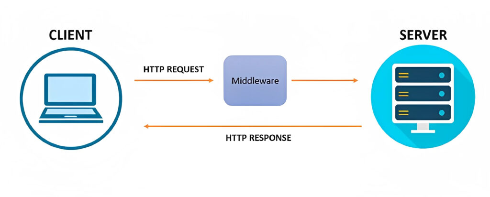

# jwt-validate


JSON Web Token (JWT) is an open standard (RFC 7519) that defines a compact and self-contained way for securely transmitting information between parties as a JSON object. This information can be verified and trusted because it is digitally signed. JWTs can be signed using a secret (with the HMAC algorithm) or a public/private key pair using RSA or ECDSA.

This guide demonstrates how to integrate Auth0 with any new or existing Python API built with Flask. We're going to use a library called Authlib to create a `ResourceProtector`, which is a type of Flask decorator that protects our resources (API routes) with a given validator.

The validator will validate the Access Token that we pass to the resource by checking that it has a valid signature and claims.

We can use AuthLib's `JWTBearerTokenValidator` validator with a few tweaks to make sure it conforms to our requirements on validating Access Tokens.

To create our `Auth0JWTBearerTokenValidator` we need to pass it our domain and audience (API Identifier). It will then get the public key required to verify the token's signature and pass it to the `JWTBearerTokenValidator` class.

We'll then override the class's `claims_options` to make sure the token's expiry, audience and issue claims are validated according to our requirements.



Follow this for exact steps: [auth0 flask](https://auth0.com/docs/quickstart/backend/python/interactive)

### Setup steps:

- Go into auth0 dashboard and click `Applications` -> `APIs`. Follow steps to create a new API. Add an identifier to group API endpoints for monitoring. It does not need to be a valid URL. Then click the `Test` tab and copy the `cURL` command or any code that you are comfortable using (i.e python, java).   

- Within the middleware code, update the values in `.env`: 

```
AUTH0_DOMAIN=
API_IDENTIFIER=
```
and append this to the end of `server.py`: 

```
if __name__ == "__main__": 
    APP.run(host="0.0.0.0", port=5000, debug=True) 
```

and run the application, in this case, `python server.py`. It will take about 3-5 mins to start the server. 

  
- In separate terminal, run the code and obtain the access token output: 

```
curl --request POST \ 
  --url https://{AUTH0_DOMAIN}/oauth/token \ 
  --header 'content-type: application/json' \ 
  --data '{"client_id":"{CLIENT_ID}","client_secret":"{CLIENT_SECRET}","audience":"{AUDIENCE}","grant_type":"client_credentials"}' 
```

- Then copy just the access token value from the `POST` response above and then run: 

```
curl --request GET --url http://localhost:5000/api/private \ 
 --header 'Authorization: Bearer ACCESS_TOKEN' 
```

- Ensure you copy and paste the access token properly in the `GET` request above. You should obtain a message: 
`"Hello from a private endpoint! You need to be authenticated to see this."` 
  
- This ensures the middleware validation works.
